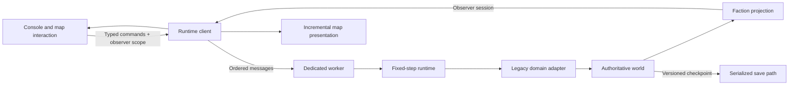

# WarSim Phase 1: authoritative runtime and smooth command map

Implemented 28 September 2026. The existing domain models now execute inside a dedicated worker, behind versioned commands and checkpoints. This phase establishes the runtime and presentation foundation for the physical engagement and tactical renderer in Phase 2.

## Architecture



| Module | Responsibility |
| --- | --- |
| `lib/warsim/contracts.ts` | Protocol/model versions, commands, receipts, checkpoints, observation/collection/communication/dependency/reservation contracts |
| `context.ts` | Seeded combat and identifier streams, deterministic ID counter, synchronous dependency context |
| `commands.ts` | Existing deployment, mission, readiness, network, operations and control actions extracted from React |
| `runtime.ts` | Legacy-save adaptation, authoritative state, frozen equipment snapshot, command ordering/validation, checkpoint/restore and fixed model steps |
| `scheduler.ts` | Bounded wall-time pacing, overload policy, pause and visibility reset |
| `simulation.worker.ts` | Worker protocol, yielding task loop, snapshots, diagnostics and failure reporting |
| `useSimulationRuntime.ts` | Worker lifetime, command transport, acknowledged views, save queue, recovery and exit |
| `projection.ts` | Faction projection for UI/map, separate from the complete persistence checkpoint |
| `presentation.ts`, `mapPresentation.ts` | Stable feature IDs, source diffs, cached static sources and endpoint interpolation |

`useWarSim` retains selection and route-picking UI state and sends commands. It no longer ticks the engine or applies session reducers. Catalogue edits do not change an active runtime's equipment definitions; a new session uses the current catalogue.

## Clock, reproducibility and commands

Every model step is **100 ms of simulation time at an internal multiplier of 1**. The requested 1x/3x/5x/10x/30x speed changes pacing, not the model step. The scheduler executes at most one step per task so command and visibility messages get opportunities to run. It caps admitted wall time at 250 ms per callback and accumulated debt at eight model steps. An overloaded host runs below the requested speed; it never compensates by skipping model ticks or increasing their duration. The UI reports this slowdown.

Hiding the document suspends stepping and resets scheduler debt. Returning to the tab resumes pacing from a fresh wall-time reference. Pause/resume and speed controls also reset pacing debt. Worker lifetime follows the active session, not play/pause toggles.

Each command has a protocol version, sequence, execution tick, faction and command-group scope. Immediate UI commands are assigned the current tick when the worker receives them; scheduled commands retain their explicit tick. Due commands run by execution tick and sequence. The receipt records acceptance/rejection and the applied tick. Validation includes stale/duplicate sequence rejection, faction/platform/base/network ownership, finite values, supported speed and checkpoint compatibility. Rejected actions operate on a disposable draft and restore RNG state.

Runtime-dependent IDs and randomness use a module context instead of replacing JavaScript globals. The initial production seed is derived from the session ID; the checkpoint stores both RNG streams, identifier counter and logical epoch. Identical starting state and accepted commands produce the same outcomes in the supported JS runtime. This is verified for a completed engagement, including save/restore while weapons are in flight. Cross-engine floating-point bit identity is not promised.

## Observer boundary and future intelligence

The session sent to panels and map contains the selected faction's entities, bases, contacts, networks, satellites, events and reports. Other-faction contacts/quotas/personnel and the runtime metadata are removed. Own outgoing weapon tracks are included; an incoming-weapon observation model remains future work. Faction changes replace the view atomically and clear presentation caches. The full checkpoint is carried separately for persistence and is not used as the rendered session.

Legacy contact fields and reports retain their existing information quality, including exact estimates or overconfident damage summaries produced by the old models. Phase 3 must replace those semantics with uncertain observations and assessed outcomes. Phase 1 establishes a projection boundary; it does not claim a complete fog-of-war model.

Collection tasks, evidence lineage, command-group knowledge scopes, queued messages, support dependencies and resource reservations have typed persisted contracts. The current UI uses faction headquarters scopes (`player:hq`, `enemy:hq`). Delayed dissemination, evidence fusion, subgroup switching and mission support-loss behavior are not executed yet. Tests verify that queued messages and reservations survive a checkpoint unchanged. The three Phase 3 behavior placeholders remain explicit.

## Persistence and recovery

The outer document remains compatible with `WarSimSession`. A `runtime` member adds schema/model versions, tick origin, frozen definitions, RNG/counter state, next command sequence, pending commands, accepted command history and coordination state. Legacy sessions without this member are adapted in memory. Restored sessions start paused. Before writing the first versioned checkpoint for a paused legacy session, the client queues a separate `warsim-legacy-<id-hash>` copy in the existing document store.

Autosave persists the latest acknowledged checkpoint about every four seconds and after commands/status changes. Saves and the final exit clear are serialized. Unload mirrors the last acknowledged checkpoint as paused to the existing browser store. Commands not yet acknowledged at unload are not claimed as saved. The existing localStorage/files persistence limitations documented in the [migration inventory](migration-inventory.md) still apply; this phase does not add transactional database storage.

Worker startup, decoding and execution failures stop the runtime and show an error with reload/exit controls. Reload creates one replacement worker from the last acknowledged checkpoint, paused. Unsupported runtime versions and malformed state are rejected before simulation; the original active document is not replaced by a failed adaptation.

## Map presentation

Moving entity and weapon features have stable IDs. Main-source content is cached; unchanged static collections are not resubmitted. Existing moving/contact features use `GeoJSONSource.updateData` diffs for geometry and changed properties; additions/removals are explicit. Animation affects only presentation and does not modify a checkpoint or consume simulation RNG.

Entity positions and weapon endpoints interpolate between received states with a 100–1,000 ms bounded delay and a nominal 30 Hz submission budget. They stop at the latest processed position without extrapolation. Longitude interpolation follows the short path across the date line. Pausing snaps to the processed state. Contact estimates update discretely; a lost contact is removed explicitly. This is a command-map foundation, not the later detailed 3D scene.

The stable-ID requirement was checked against the installed MapLibre API and its [GeoJSONSource documentation](https://maplibre.org/maplibre-gl-js/docs/API/classes/GeoJSONSource/). Worker creation uses the bundler-relative URL form documented by [MDN](https://developer.mozilla.org/en-US/docs/Web/API/Worker/Worker).

## Measurements

Reports: [Phase 1 core](baselines/phase-1-core.json), [Phase 1 browser](baselines/phase-1-browser.json). Historical [Phase 0 reports](phase-0.md) are retained.

Same reported machine/configuration: Ryzen 7 7445HS, 12 logical cores, Windows 10.0.26200, Turbo power plan, Chromium 153.0.8010.12, 1920 x 1080, Next development/StrictMode and headless SwiftShader. Fixtures are version 1. The fleet contains 100 platforms and 50 active projectiles; camera and offline basemap are unchanged. These are short development/software-rendering captures, not production GPU performance claims.

| Fleet metric | Phase 0 median / p95 | Phase 1 median / p95 |
| --- | ---: | ---: |
| Headless core step | 274.263 / 321.094 ms | 125.945 / 150.193 ms |
| Browser engine step | 435.0 / 524.3 ms | 383.2 / 433.4 ms |
| Browser frame interval | 566.6 / 666.6 ms | 116.6 / 133.3 ms |
| React subtree render duration | 6.1 / 7.3 ms | 6.5 / 7.2 ms |
| Synchronous map synchronization | 0.5 / 1.2 ms | 1.2 / 1.8 ms |

The Phase 1 browser capture observed 30 engine steps, 113 frame intervals and 198 incremental source submissions across 12.59 seconds. **No full source resubmissions** were needed after warmup. Incremental calls had a p95 of 0.1 ms; many individual samples round to zero. Submission timings exclude asynchronous map worker and GPU work.

The core improvement comes from skipping sensor candidates that cannot improve an already selected Tier 2 result and skipping terrain samples outside the unmasked detection envelope. The current terrain modifier never increases range. A full fleet-checkpoint hash captured before pruning matches after pruning; no terrain or detection equations were changed.

Page-isolate heap after GC changed from 31,743,120 to 32,428,048 bytes during the browser capture (worker heaps excluded). The saved checkpoint was 326,233 bytes. Short heap observations do not establish leak freedom. The new headless core report also records runtime heap before/after GC and checkpoint size.

The UI is substantially more responsive and the core cost is lower, but the fleet still exceeds the 100 ms step budget. Fixed steps therefore advance less simulated time than the former wall-delta loop over the same wall-time capture. Further engine optimization and a production hardware-GPU profile remain necessary before claiming real-time fleet throughput or AAA presentation.

## Reproduce and verify

Use the Chromium setup from [Phase 0](phase-0.md). Run performance captures sequentially:

```sh
npm run test
npm run typecheck
npm run test:e2e
npm run bench:warsim:runtime
npm run bench:warsim:browser
npm run build
```

`bench:warsim:runtime` writes `.cache/warsim-baseline/phase-1-core.json`; the browser command writes `.cache/warsim-baseline/browser.json` and `fleet.png`. Source hashes identify the captured implementation. No additional production dependency was required.

Coverage includes deterministic outcomes/IDs, acceleration invariance, in-flight checkpoint continuation, pending messages/commands/reservations, command rejection, observer isolation, pause/hidden time, map interpolation/diffs, legacy imports, browser workflows, worker lifetime and worker-failure recovery. The isolated server rejects disk writes and verifies protected-file hashes.

Verified: **31 core/migration/runtime/presentation tests pass**, **five browser workflows pass**, the fleet browser benchmark passes, and TypeScript validation plus the production build pass. Three explicit Phase 3 intelligence tests remain placeholders.

Next: Phase 2's bounded physical engagement and tactical renderer spike. Use the fleet cost and frame measurements here to set its quality and throughput budgets. Intelligence/coordination behavior remains scheduled for Phase 3 behind the contracts established here.
