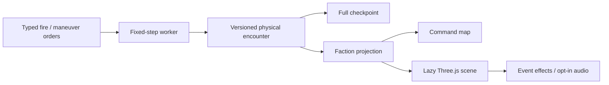

# Phase 2: physical encounter and tactical renderer

Delivered 28 September 2026. This phase adds an opt-in, fictional surface engagement and a Three.js tactical viewport. The broader multidomain engine continues through the Phase 1 adapter. This is the first playable 3D foundation; production AAA assets, terrain, destruction, weather, and validated equipment models remain future work. The later [Phase 3 reference](phase-3.md) replaces the exact-sensing behavior described below.

## Try it

1. Open **War games → War Sim → Coastal encounter · 3D physics**.
2. Select a friendly ship and an observed contact. Press **Launch guided round**, then **Start time**.
3. The defender automatically attempts interception inside 1.8 km. Repeated launches consume magazines; each launcher has a 1.5-second cooldown.
4. Adjust course/speed, follow the selected vessel, use Overview, or return to the command map. Both views use the same worker state and selection.
5. Sound starts off. Enable it explicitly for spatially attenuated launch/termination cues. Balanced graphics reduces resolution under sustained load; High enables shadows and up to 2× device pixel ratio.

Existing sessions can open **Open 3D tactical view**. Their simulation model remains the legacy adapter. The scene is an ocean reference environment: it does not supply terrain, bathymetry, or a detailed model for every catalogue platform.

## Architecture



| Module | Responsibility |
| --- | --- |
| `lib/warsim/physics/coordinates.ts` | WGS84 geodetic/ECEF/ENU conversions; SI vector operations; relative swept-sphere contact time |
| `physics/types.ts` | Serializable physical actors, rounds and events; profile version |
| `physics/model.ts` | Ship constraints, guidance/forces, continuous interactions, ammunition/fuel/damage, observation and map adapters |
| `physics/reference.ts` | Independent synthetic encounter factory; no stored-board reads |
| `warsim/runtime.ts` | Routes the authoritative step to the selected model; validates commands/checkpoints |
| `warsim/projection.ts` | Removes hostile actor truth, resources, weapon intent and unseen events before presentation |
| `warsim/tactical/scene.ts` | Interpolation, camera, floating render origin, water/sky, trails/effects, audio, quality and GPU lifecycle |
| `tactical/assets.ts` | Authored procedural metre-scale frigate and generic aircraft/track assets |
| `components/wargames/TacticalViewport.tsx` | Selection, playback, maneuver/fire controls and engagement log |

The 100 ms authoritative step is split into five 20 ms physics substeps. The model uses constant mass, thrust during a finite burn, quadratic drag, constant gravity, and bounded normal guidance acceleration. The reference cruise path holds a synthetic altitude before terminal descent. Platform speed, acceleration, deceleration and turning are bounded; fuel exhaustion causes deceleration. No real equipment performance is inferred from these parameters.

Collision uses the relative swept trajectory of both bodies, including fast crossings. Candidate contacts resolve in chronological order within each substep. An interceptor can terminate both rounds in a single event, and terminated rounds cannot subsequently impact. Events record the contact position, fractional simulation time, and terminated IDs. Ammunition is removed once at launch. Damage is an explicit synthetic hit-point reduction; it is not structural or blast simulation.

The scene uses metres with east/up/south axes, while physics uses east/north/up. Camera panning rebases the render origin after 2 km of horizontal displacement without moving simulation coordinates. This local flat-water model is intended for approximately 25 km encounters. The WGS84 conversion is global; the local physics/environment assumptions are not.

## Knowledge and persistence

The reference sensor has a 9 km range and immediate, exact measurements. Hostile platforms appear as contact markers. Friendly resources and observed projectile kinematics are available; hostile actor objects, magazines, course orders, projectile target IDs and historical launch positions are removed from observer snapshots. Effects and audio consume only projected events. Switching faction reconstructs the scene and clears audio/effect state. Opening a view does not replay historical effects.

This is deliberately limited sensing. Uncertainty, stale tracks, processing/sharing delays, emitter policy, command-group knowledge and coordinated support are Phase 3. The reference seeker uses perfect measurements within its declared acquisition range; it is not yet a network-supported guidance model.

Physical state is optional in `WarSimSession`, with `version: 1` and `model: coastal-pointmass-v1`. Actors, projectiles, resources, event sequence, runtime clock, commands and RNG survive checkpoint/reload. Unknown versions and invalid resources are rejected. Physical sessions accept only their supported fire/maneuver/playback commands, preventing legacy reducers from corrupting the physical state. Existing legacy session fixtures retain their deterministic hash.

## Rendering and assets

Three.js **0.186.1**, types **0.186.0**, pinned in the lockfile. The chunk is loaded when opening the tactical view. Ship geometry, deck fittings, radar mast, railings, launch cells, helipad markings and wake shaders are authored in code; no downloaded asset/texture licensing or network dependency is introduced. Atmospheric sky, procedural water, sunlight, hemisphere lighting, ACES tone mapping, optional shadows and trails form the first asset/lighting pass.

Map moving-source presentation stops while 3D is open. Simulation remains in its existing worker. RAF, controls, listeners, geometry, materials, shadow buffers, audio and WebGL context are released on scene close or faction change. A lost context displays recovery instructions and the command-map return remains available.

## Verification and measurements

Commands:

```sh
npm test
npm run typecheck
npm run build
npm run test:e2e
npm run validate:warsim:physics
```

- **40 unit/integration tests pass**, with three existing Phase 3 intelligence placeholders. New checks cover coordinate round trips (less than 1 mm), analytic ballistic position (less than 1e-7 m after 10 s), fast/moving collision crossings, guided impact, defensive interception, one termination per launched round, ammunition, maneuver/fuel bounds, replay from an in-flight checkpoint, observer filtering and rejected saves/orders.
- **Six browser workflows pass**, including the new launch/fire/intercept/pause/faction/map-return/graphics-loss/reopen/exit flow. Browser tests isolate all stored documents and prohibit writes to user data.
- The numerical script writes a standalone trajectory SVG and JSON to `.cache/warsim-baselines/`. The unopposed reference shot impacted at **10.286 s**, leaving **45/100** target integrity. The curve is a model diagnostic, not a real-world validation claim.
- Node two-ship transit, including observer projection and checkpoint cloning: **0.050 ms median / 0.116 ms p95**, 900 measured ticks after 100 warm-up ticks. This small case is not comparable to the prior 100-platform fleet workload.
- Browser capture: headless Chromium 153, Next development, 1920×1080, SwiftShader software GPU, offline basemap. Balanced settled at **0.5 pixel ratio**; tactical callback intervals were **35.9 ms median / 41.2 ms p95** (about 28 FPS average), compared with roughly 10 FPS at full resolution. Synchronous render submission was **0.8 / 1.3 ms**, which excludes asynchronous GPU work. Worker steps were **0.2 / 0.4 ms**. There were **zero map moving-source submissions** during the measured 3D window.

The software-GPU result supports a playable reference on the adaptive preset. It does not establish 60 FPS or discrete-GPU performance. High-preset performance, long-session memory behavior, large 3D populations and production art fidelity remain unverified. Screenshot and raw captures are in `.cache/warsim-baselines/`; checked-in [browser measurements](baselines/phase-2-browser.json), [physics measurements](baselines/phase-2-physics.json) and the [trajectory plot](baselines/phase-2-trajectory.svg) accompany this guide.

## Next: Phase 3

Replace reference exact sensing with observations, track confidence/uncertainty, collection tasks and delayed dissemination. Introduce local/group/faction knowledge and resource reservations, then connect seeker support, defensive coordination and mission dependencies to those contracts. Keep both visual surfaces on the observer projection throughout.
