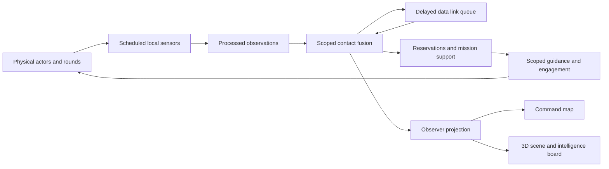

# Phase 3 reference: intelligence and coordination

Implemented 28 September 2026 for the optional Glasswater coastal encounter. The live legacy WarSim still runs its existing air, land, sea, subsurface, and space rules through the Phase 1 adapter. This release makes intelligence and coordination authoritative in the three-vessel physical reference; it does not yet replace those legacy domain models or complete the larger joint-scenario milestone in `warsim_plan.md`.

## Try it

Open **War games → War Sim → Coastal encounter · 3D physics**, then **Intel & coordination**. The board can switch among headquarters, faction, coalition, and friendly platform views. A local sensor may see a contact before HQ does. Select FS Surveyor to request an area search, change its emission or data link, and inspect dated evidence, coverage, and contact confidence. A coordinated strike reserves one shooter round and one support sensor channel. Choose **Hold and resume**, **Abort and release**, or **Continue on local track** for support loss. Start time to deliver reports and execute eligible missions. The command map and 3D scene draw reported positions and uncertainty; the 3D scene also draws active mission support lines.

## Model and data flow

`lib/warsim/intelligence.ts` owns serializable observations, per-scope tracks, sensor schedules, collection tasks, coverage records, messages, sharing links, missions, and reservations. `physics/model.ts` samples the physical world only inside sensor, seeker, collision, and movement calculations. Fire orders resolve a scoped contact ID and revision. A weapon steers toward a received estimate or its own acquired seeker observation; it no longer steers toward the hidden target position. Local defensive fire requires a fresh local missile track. The worker checkpoints intelligence with the physical state; a restore rejects conflicting copies. `projection.ts` removes hostile actor resources, unobserved rounds and effects, internal target references, and pending event deliveries before either renderer receives a snapshot.

The synthetic reference uses radar scans every 0.5–1 second, 0.3-second processing, 1-second local-to-HQ delay, 0.5-second HQ-to-faction delay, and optional 2-second faction-to-coalition delay. The main ship sensor reaches 2.5 km; the scout and opposing ship reach 9 km. A scenario-authored initial HQ briefing has a 600 m uncertainty. Contact uncertainty grows with age; tracks become stale after 1.5 seconds and lost after 4.5 seconds without fresh observations. Sensor time is a modeled consumable. Area searches record positive or negative coverage only after sensing, processing, and any required reporting path. Evidence IDs prevent duplicate forwarding from raising confidence twice. Link loss expires undelivered reports and holds or aborts dependent missions according to the selected fallback.

The tactical scene shows contact uncertainty rings and support lines; the map shows geographic uncertainty regions. The board lists report history, source, observation and delivery times, coverage, link state, sensor time, and reservations. These are estimates and workflow indicators, not identification or battle-damage assessment of real equipment.

## Persistence and compatibility

New physical checkpoints store `PhysicalIntel` under the encounter and runtime coordination state. Older Phase 2 physical saves without it are upgraded from their **reported faction contact positions**; migration does not create contacts from hidden actor positions. Imported report age increases uncertainty and reduces confidence. Old event visibility IDs are mapped to HQ scopes. The legacy scenario/session format and custom equipment catalogue are unchanged. Physical reference parameters remain a fictional `coastal-pointmass-v1` profile and do not modify user-authored ships or missiles in legacy sessions.

## Verification

- 52 unit and integration tests pass. The Phase 3 cases cover local processing and delayed sharing, scope isolation, contact aging, positive and negative collection, interrupted reports, evidence deduplication, resource reservations, hold/abort/local fallback, seeker gating, delayed effects, checkpoint replay, and old physical save import.
- Nine isolated Chromium workflows pass, including the new intelligence board flow and prior launch, faction, recovery, save, and basemap workflows. The browser fixture blocks writes to user documents.
- TypeScript and production build pass. The numerical reference script passes with a guided impact and writes its synthetic trajectory artifact under `.cache/warsim-baselines/`.
- In one Node reference run of 900 measured ticks after warm-up, step + observer projection + full checkpoint clone measured **2.49 ms median / 3.99 ms p95**. This is a small three-vessel scenario, not a large-force or 60 FPS claim.

## Remaining gates

The reference still has surface vessels and one fictional point-mass weapon. Its radar and seeker error models, energy budget, link failure behavior, fusion, and damage are illustrative; they are not calibrated against real systems. Target classification ambiguity, contradictory reports, estimated damage, terrain/weather, cross-domain support, detailed readiness and damage, broad mission phases, complete replay/AAR, and finished high-end art remain for later phases. In particular, the full saved joint scenario in the plan requires air and ground support and is not yet satisfied by Glasswater. The legacy engine remains available until feature parity and saved-data migration are verified.
